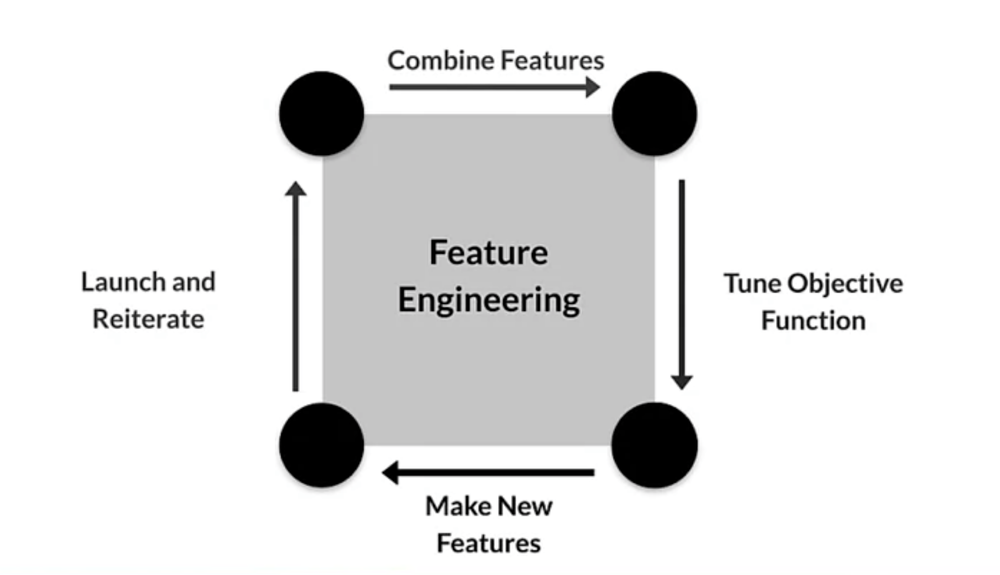

# Data

## Data Inspection

- Identiry data sources
- Check how they are refreshed
- Consistency (formatting, data types)
- Outliers and errors

## Responsilbe Data

- Bias in data
- User privacy: 
  - Aggregation: replace unique values with summary
  - Redaction: remove some data to create less complete picture
- Compilance with GDPR and other regulations

## Data Problems

### Data/Concept Drift



**Data changes**:
- Trend and seasonality
- Distributiob of features changes
- Relative importance of features changes

<--->

**World changes**:
- Style changes
- Scope and processes change
- Competitors change
- Business expands to other geos



| Drift Pace                 | Slow                                                                   | Faster                                                                                                  | Really Fast                                                                                             |
|----------------------------|------------------------------------------------------------------------|---------------------------------------------------------------------------------------------------------|---------------------------------------------------------------------------------------------------------|
| Ground truth change period | months, years                                                          | weeks                                                                                                   | days, hours, minutes                                                                                    |
| Retraining driven by       | - model improvements - better data - changes in software/systems | - Declining model performance - model improvements - better data - changes in software/systems | - Declining model performance - model improvements - better data - changes in software/systems |
| Labeling                   | - Curated datasets - Crown-based                                    | - Direct feedback - Crowd-based                                                                      | - Direct feedback - Weak supervision                                                                 |
|                            |                                                                        |                                                                                                         |                                                                                                         |                                                                                    |

### Sudden Problems

- **Data collection problem**: bad sensor, bad log data, moved or disabled sensor
- **System problems**: bad software update, loss of network connectivity, system down, bad credentials

### Detecting Problems

- Label new training data to handle changing ground truth
- Validate data (schema, distribution)
- Monitor models

## Data Labeling

- Process Feedback (direct labeling)
  - Continuous dataset creation
  - Lables avolve quicly
  - Captures strong label signals
  - Not always possible
  - Individual design
  - Tools: Logstash, fluentd, Google Cloud Logging, AWS ElasticSearch, Azure Monitor
- Human Labeling
  - slow
  - difficult for many dataset
  - expensive
  - small datasets
- Semi-supervied labeling
- Active Learning
- Weak Supervision

## Data Validation

Typical workflow with TensorFlow Data Validation (TFDV)
- Infer schema (columns, constraints, domains) from training dataset and calculate statistics for each feature
- Check for anomalies (compare statistics) in evaluation dataset and adjust schema
- Store the schema
- Validate input serving data with the schema
- Monitor serving data statistics and track data drift

## Data Preprocessing

**Data Preprocessing** transforms raw data into a clean and training-ready dataset.

Preprocessin Operations:
- Data cleansing
- Feature tuning (scaling, normalizing, ...)
- Representation transformation
- Feature extraction
- Feature construction


It is important that data preprocessing during training must also be applied correctly during serving


Text preprocessing techniques:
- stemming
- lemmatization
- TF-IDF
- n-grams
- embedding lookup

Image preprocessing techniques:
- clipping
- resizing
- cropping
- blug
- canny filters
- Sobel filter
- photometric distortions

### Scaling

Rescale numeric range to fit another range, that is more performant for ML model. 

Example: greyscale pixel [0, 255] is usually rescaled to [-1, 1].

### Normalization

Transform any numeric range to [0, 1].


X_{norm} = \cfrac{X - X_{min}}{X_{max} - X_{min}}


### Standardization

**Z-score**: number of standard deviations away from the mean.


X_{std} = \cfrac{X - \mu}{\sigma}


### Bucketizing / Binning

**Bucketizing (Binning)** is a grouping technique, that creates categories from a numeric range.

### Feature crossing
**Feature crossing**: combining multiple features into one.
Example: week + hour = hour of the week.

### Other techniques

Dimensionality reduction in embeddings:
- Principal component analysis (PCA)
- t-Distribution stochastic neighbor embedding (t-SNE)
- Uniform manifold approximation and projection (UMAP)

## Preprocessing Data at Scale

- Real-world models can be terabytes of data.
- Large-scale data processing frameworks should be used to handle such a volume.
- Consisnent trasformation between training and serving is crutial.

### When do you transform?

|                                    | Pros                                                            | Cons                                                                                                                                                         |
|------------------------------------|-----------------------------------------------------------------|--------------------------------------------------------------------------------------------------------------------------------------------------------------|
| Pre-process whole training dataset | Run-once Compute on entire dataset                           | Transformations reproduced at serving Slower iterations                                                                                                   |
| Within a model                     | Easy iterations Transform guarantees                         | Expensive transforms Long model latency Transformations per batch: skew                                                                                |
| Transform per batch                | Access to a single batch, not the full dataset Scales better | Deal with normalization and other "wide" transformations: - normalize by average withing a batch - precompute average and reuse it in batch processing |

### Prefetch transformation

To optimize narrow transformations, the "prefetch" transformation can be used. It fetches the next batch of data 
ahead of time, while the previous batch is still processing. This approaches minimizes the idle time.

## Feature Selection

**Feature Space**: n-dimensional space that has each feature of a dataset as an axis.  
Training is learning the decision boundry in a feature space: a line in 2D, a surface in 3D, etc...
Feature Space Coverage: train/eval dataset should cover the same areas of Feature Space that the serving dataset does.
- same numerical ranges
- same classes
- similar characteristics for image data
- similar vocabulary, syntax and semantics for NLP data

**Feature Selection**: 
- identify features that best represent the relationship
- remove features that don't influence the outcome
- reduce the size of the feature space



**Unsupervised**
In unsupervised feature selection method the target column is not considered.

It looks for correlation between features and removes features that 
highly correlate with some other ones. 

<--->

**Supervised**

Target column **is** not considered.

It selects features that contibute to the result the most.



Supervised methods:
- Filter methods
- Wrapper methods
- Embedded methods

### Filter methods
- Correlation (between features and between features and the label)
- Univariate feature selection

To detect correlation the **correlation matrix** can be used.

Correlation tests:
- Pearson correlation: lenear relationship
- Kendall Tau Rank Correlation Coefficient: monotonic relationships and small sample size 
- Spearman's Rank Correlation Coefficient: monotonic relationsships

Other methods:
- Mutual information
- F-test
- Chi-Squared test

### Wrapper methods


**Forward selection**
- Start with 1 feature
- evaluate model performance when **adding** each of the additional features, one at a time
- Add the one that permorms best
- Repeat until there's no improvement

<--->

**Backward elimination**
- Start with all features
- evaluate model performance when **removing** each of the included features, one at a time
- Remove the one that permorms worst
- Repeat until there's no improvement

<--->

**Recursive elimination**
- Select a model for evaluating feature improtance (not all models are able to do that)
- Select the desired number of features
- Fit the model
- Rank features by importance
- Discard least important features
- Repeat until the desired number of features remains



### Embedded methods

Depends on the model you are using.

- L1 regularization
- Feature importance

